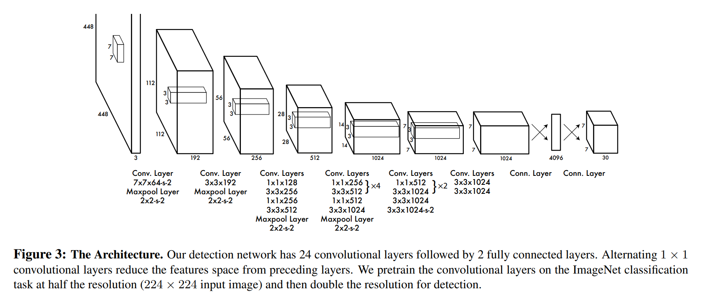

# YOLO Implementation in Keras (TensorFlow 2)
In this project, I attempt to implement and train YOLO (v1) as described in the paper [You Only Look Once](https://arxiv.org/pdf/1506.02640.pdf) using TensorFlow 2's Keras API implementation. I also used some details in the [yolov1.cfg](yolov1.cfg) file provided by the author of the paper at github.com/pjreddie/darknet.

## YOLO Architecture
<div style="text-align: center;">

</div>

## Dependencies
All the packages used in this project are in the [requirements.txt](requirements.txt) file. For example, you can use pip to install them in a virtual environment like so:

```
pip install -r requirements.txt
```

## License
MIT License, check the [LICENSE](LICENSE) file.